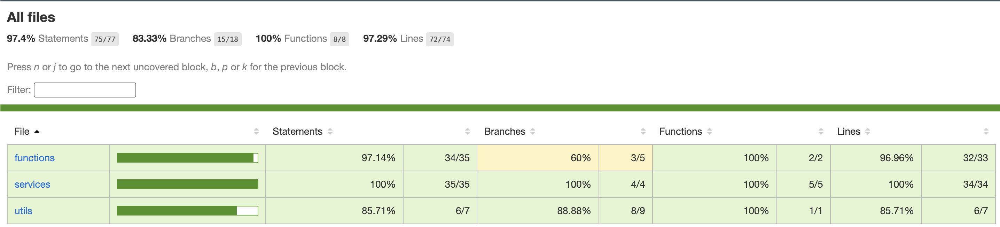
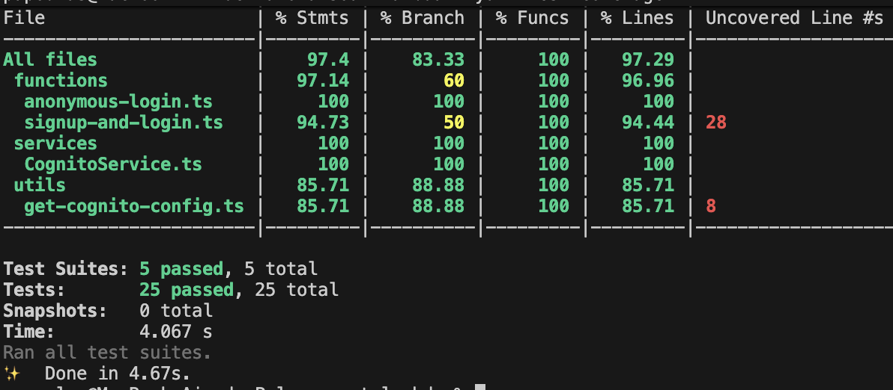

# Tech Challenge - Módulo de Autenticação (AWS Lambda & Cognito)

Este repositório contém o microserviço de autenticação responsável por gerenciar usuários no **AWS Cognito**. Ele utiliza funções Lambda para processar o cadastro e login de clientes identificados (via CPF) ou visitantes anônimos.

## 🏗️ Arquitetura e Fluxos

O projeto é baseado em duas funções principais que consomem um serviço centralizado do Cognito:

### 1. Login Identificado (`signup-and-login.ts`)
Fluxo destinado a usuários que fornecem dados pessoais.
* **Entrada:** Recebe `name`, `email` e `documentNumber` via corpo da requisição.
* **Processamento:** * Realiza a sanitização do CPF (remove caracteres não numéricos).
    * Verifica a existência do usuário no User Pool.
    * Se o usuário já existe: Realiza o login e retorna `200 OK`.
    * Se o usuário não existe: Realiza o `signUp`, confirma o cadastro e efetua o login automático, retornando `201 Created`.

### 2. Login Anônimo (`anonymous-login.ts`)
Fluxo para navegação rápida sem identificação prévia.
* **Processamento:** * Gera um identificador único aleatório com o prefixo `anon_` usando `node:crypto`.
    * Cria um usuário temporário no Cognito com o nome "Visitante".
    * Retorna um Token JWT para autenticação em rotas protegidas que aceitem acessos anônimos.

[Image of AWS Lambda and Cognito authentication architecture flow]

---

## 🛠️ Tecnologias Utilizadas

* **Runtime:** Node.js com TypeScript.
* **SDK:** `@aws-sdk/client-cognito-identity-provider` (v3).
* **Testes:** Jest e `aws-sdk-client-mock`.
* **BDD:** Cucumber.js (jest-cucumber).

---

## ⚙️ Configuração (Variáveis de Ambiente)

As funções dependem das seguintes variáveis para se comunicarem com a infraestrutura da AWS:

| Variável | Descrição |
| --- | --- |
| `COGNITO_USER_POOL_ID` | ID do User Pool no Amazon Cognito. |
| `COGNITO_APP_CLIENT_ID` | ID do App Client para autenticação. |
| `AWS_REGION` | Região AWS onde o Cognito está configurado. |

---

## 🧪 Qualidade e Testes (BDD)

O projeto segue práticas de **BDD (Behavior-Driven Development)**. As regras de negócio, como a formatação de CPF e fluxos de exceção (usuário não confirmado ou não encontrado), são validadas através de testes automatizados que mockam as respostas do SDK da AWS.




### Comandos de Teste
```bash
# Instalar dependências
npm install

# Executar testes unitários e BDD
npm test

# Gerar relatório de cobertura de código
npm run test:coverage